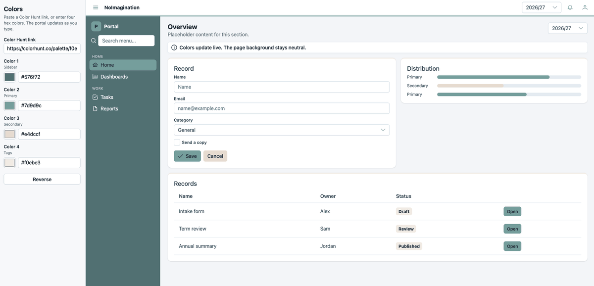

<div align="center">

# NoImagination

**See how a Color Hunt palette actually looks in an application.**

Paste a palette link, or four hex colors, and a dashboard updates live.

[](https://skyeph.github.io/NoImagination/)
[](https://angular.dev/)
[](https://primeng.org/)

</div>

---

<div align="center">
  
</div>

---

## Why NoImagination?

Four swatches on Color Hunt are not a screen. A color that looks calm in a square can disappear on a button, or take over a sidebar.

NoImagination puts the palette on one dashboard — sidebar, buttons, links, tags, and cards — so you can judge it before you use it. Change a color and the screen updates as you type. It does not generate a project.

## Features

<table>
  <tr>
    <td><strong>Color Hunt link</strong></td>
    <td>Paste a palette URL and the four colors fill in. Nothing is fetched from Color Hunt.</td>
  </tr>
  <tr>
    <td><strong>Live colors</strong></td>
    <td>Pickers and hex fields update the portal as you type.</td>
  </tr>
  <tr>
    <td><strong>Fixed roles</strong></td>
    <td>Each color always lands in the same place, so palettes are easy to compare.</td>
  </tr>
  <tr>
    <td><strong>Neutral canvas</strong></td>
    <td>The page background stays light gray. The palette is the accent, not the wallpaper.</td>
  </tr>
  <tr>
    <td><strong>Reverse</strong></td>
    <td>Flip the four colors and see the same screen in the opposite order.</td>
  </tr>
  <tr>
    <td><strong>Safe fallback</strong></td>
    <td>Empty or invalid values fall back to plain neutrals.</td>
  </tr>
</table>

## Where the colors go

<table>
  <tr>
    <td><strong>Color 1</strong></td>
    <td>Sidebar, with text chosen for contrast</td>
  </tr>
  <tr>
    <td><strong>Color 2</strong></td>
    <td>Primary buttons, active navigation, inputs, and key accents</td>
  </tr>
  <tr>
    <td><strong>Color 3</strong></td>
    <td>Secondary buttons, links, and bars</td>
  </tr>
  <tr>
    <td><strong>Color 4</strong></td>
    <td>Tags and the highlight along the top of each card</td>
  </tr>
</table>

## Try it

Open the live demo: [skyeph.github.io/NoImagination](https://skyeph.github.io/NoImagination/)

Or run it locally:

```bash
npm install
npm start
```

Then open `http://localhost:4200/`.

A Color Hunt link looks like `https://colorhunt.co/palette/` followed by 24 hex digits — four colors, six digits each.
